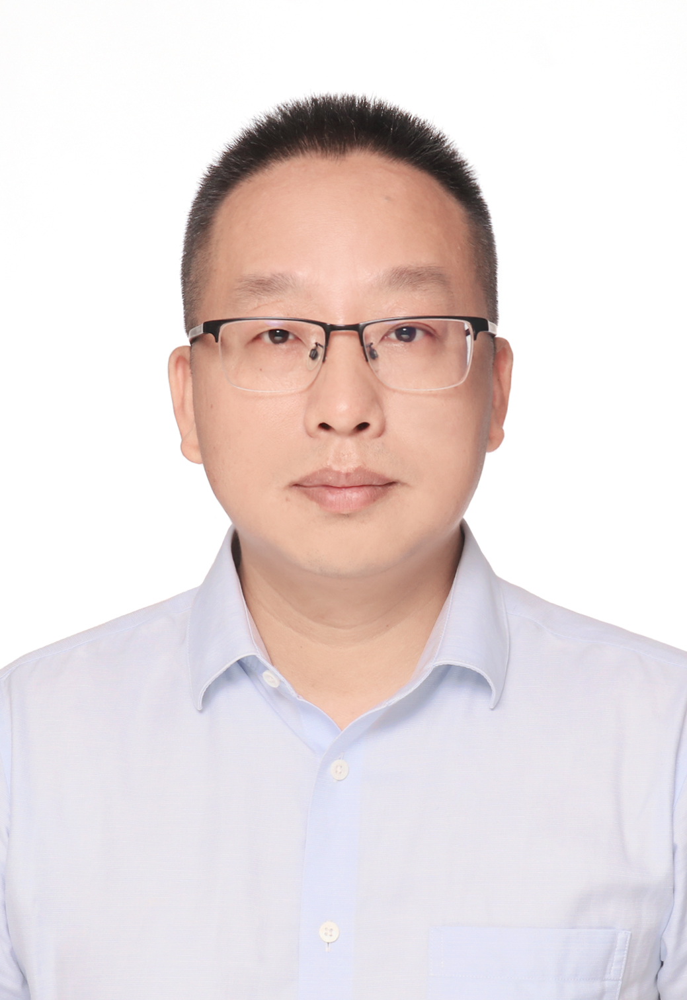

## About Me

Johnny Wang – Professional Profile

    Johnny brings over 25 years of hands-on experience in quality management, Lean Six Sigma deployment, and data-driven continuous improvement. Over the past decade, he has focused extensively on technical consulting and project development within the tobacco industry.
  
    He currently serves as Senior Product Manager and Tobacco Industry Director at China Haisum Engineering Co., Ltd. (Stock Code: 002116), within the Smart Manufacturing Division. In this role, he leads smart factory planning, digital delivery, and full-line digital intelligence upgrade initiatives for the tobacco sector — helping traditional plants transition through digital and intelligent transformation.
  
    Prior to joining Haisum, Johnny spent 11 years as General Manager of Shanghai YLZQ Management Consulting Co., Ltd., where he oversaw overall operations and business development. As lead consultant, he introduced Shainin DOE into more than 10 China Tobacco subsidiaries, delivering over 60 specialized improvement projects with a total consulting value exceeding RMB 40 million.
  
    Earlier, as Senior Consultant & Project Manager at Omnex (Shanghai ) Consulting, he managed Lean Six Sigma business development and US-based project execution — including a supply chain integration project for a global top automaker, involving over 1,000 man-days and a contract value of RMB 15 million.
  
    Before Omnex, Johnny served as Quality Initiatives Manager at Emerson Network Power China, leading Six Sigma deployment across the region and coaching over 200 GB/BB projects, which delivered cumulative savings of more than $15 million. He began his career at Sanmina-SCI as Quality System Manager, where he managed system operations, conducted TS16949 and ISO9001 audits, and trained hundreds of GB/BB candidates.

    Over the past five years, Johnny has served as technical lead (or core participant) on a series of tobacco industry research projects, including:
  
  •	Quality stability control based on primary processing intensity (host, 2021–2022)
  •	Intelligent data analysis for Xichang Cigarette Factory (host, 2022–2023)
  •	Intelligent quality improvement in packaging and wrapping processes (host, 2022–2024)
  •	Moisture control modeling for thin-plate dryers using data mining (host, 2022–2023)
  •	Comprehensive quality evaluation for slim products via intelligent algorithms (host, 2022–2023)
  •	Online data collection and system architecture for production evaluation (host, 2022–2024)
  •	Steady-state control of cigarette draw resistance (host, 2023–2024)
  •	Diagnostic analysis for cigarette manufacturing processes (host, 2024–2025)
  
    He has also built valuable expertise in formula R&D, participating in projects on filter rod forming, draw resistance stability, slim product quality systems, and process-intensity-based quality control — covering leaf compatibility analysis, formula optimization, and intelligent algorithm modeling.
  
    Johnny holds a Lean Six Sigma Master Black Belt Certification, and is also a certified Six Sigma Champion, Shainin DOE expert, and QMS/EMS Auditor. He earned his Bachelor's degree in Materials Science & Engineering from Xi'an Technological University.
  
    His technical skill set spans Six Sigma system development, GB/BB training and coaching, MSA, SPC, FMEA, classical and Shainin DOE, and process control methodologies. To date, he has trained over 420 GB/BB candidates and more than 1,000 professionals in quality tools, while coaching over 400 Shainin DOE projects — delivering cumulative client financial benefits exceeding $20 million across automotive, electronics, heavy engineering, telecom, footwear, and tobacco industries.
Johnny holds the SDOE software copyright and has co-authored multiple patents and papers with China Tobacco subsidiaries.
Looking ahead, he is focused on industrial AI agents and data governance in smart manufacturing — helping factories turn process data into stable quality and sustained improvement.

